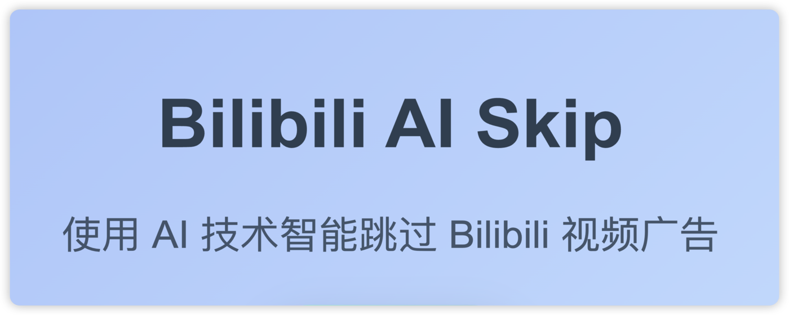

> [!TIP] 
> 1.如果本项目对您有帮助，请给项目 Star，谢谢  
> 2.推荐使用手动跳过，AI 可能识别错误  
> 3.语音解析需注册阿里云，每月免费：10小时/月，超出：0.288元/小时  
> 4.推荐使用手动控制语音解析，防止浪费免费额度

 

# Bilibili AI Skip

一个使用 AI 自动跳过 Bilibili 视频植入广告的 Chrome 扩展程序。

## 项目简介

**Bilibili AI Skip** 是一个 Chrome 扩展程序，旨在通过 AI 技术识别并自动跳过 Bilibili 视频中植入的广告。它支持字幕和音频分析，能够精准定位广告的开始和结束时间，并提供手动或自动跳过广告的功能。用户可以通过设置 API 密钥和模型来自定义 AI 分析行为。

  
  

  
## v2.3.10 版本更新
* **增加 UP主/标签 过滤**： 设置页面中设置需要过滤的UP主或标签，匹配规则的视频则不进行广告识别。

### 过往更新回顾

* **v2.3.9**：增加AI重新识别；修改icon。
* **v2.3.8**：增加人工纠错功能；键盘快捷键。
* **v2.3.6**：修复了一些已知的 bug，并优化了 AI 的提示（prompt），以提升其性能和理解能力。
* **v2.3.5**：视频进度条中的广告部分现已高亮为橙色，使广告区间更加清晰可见。
* **v2.3.4**：增加了一个内置的免费 API 选项（由作者付费维护，不定期更新），并添加了多个官方及优质第三方 AI API 的选项。
* **v2.3.3**：上架 Chrome 应用商店。

---
## 功能特性

* ​**自动跳过广告**​：通过 AI 分析视频字幕或音频，识别广告并自动跳过。
* ​**手动跳过选项**​：如果未启用自动跳过，扩展会在广告时段显示弹窗，允许用户手动跳过。
* ​**字幕和音频分析**​：
  * 优先使用视频字幕进行广告识别。
  * 如果没有字幕，可选择使用音频分析（需用户授权）。
* ​**云端数据支持**​：通过 Cloudflare API 查询已缓存的广告数据，提升效率。
* **人工纠错机制**：用户可以修正 AI 识别的广告片段，共同维护一个共享的广告时间点数据库。
* ​**自定义设置**​：
  * 支持设置 OpenAI 或 Aliyun API 密钥、URL 和模型。
  * 可启用/禁用音频分析和自动跳过功能。
* ​**用户友好界面**​：提供直观的设置页面和实时弹窗提示。

## 使用方法

1. ​**启用扩展**​：
   * 在设置页面中，确保“启用扩展”选项已勾选。
2. ​**设置自动跳过**​：
   * 勾选“自动跳过广告”以启用自动跳过功能。 (**推荐手动，AI 可能识别错误**)
   * 如果未勾选，广告时段会显示弹窗，包含跳过按钮和倒计时。
3. ​**音频分析**​：
   * 如果视频没有字幕，扩展会提示是否启用音频分析。(**推荐手动，避免浪费免费额度**)
   * 音频分析需要等待约 1 分钟，分析完成后会自动识别广告。
4. ​**查看状态**​：
   * 扩展会在视频播放器中显示弹窗，提示当前状态（如“AI 分析中...”或“广告已跳过”）。
5. **人工纠错**：
    * 如果广告被遗漏或识别不准确，可以点击播放器控制栏中的“纠错”按钮，手动定义或调整广告片段。

## 技术细节

* ​**广告识别**​：
  * 使用 OpenAI API 分析字幕或音频内容，识别广告的开始和结束时间、产品名称及广告内容。
  * 20 秒以上的广告识别，并扩展到上下文相关内容。
* ​**音频处理**​：
  * 通过阿里云 API 进行音频转录（使用 **paraformer-v2** 模型，**免费额度：10小时/月，超出：0.288元/小时**）。
  * 支持的语言：中文（含粤语等各种方言）、英文、日语、韩语、德语、法语、俄语。
* ​**数据存储**​：
  * 使用 Cloudflare API 存储和查询广告数据，避免重复分析。
* ​**前端界面**​：
  * 设置页面使用 HTML 和 CSS 构建，提供直观的开关和输入框。
  * 视频页面中的弹窗使用动态样式，支持鼠标悬停效果。

## 依赖

* ​**Chrome 浏览器**​：需要支持 Manifest V3。
* ​**API 密钥**​：
  * OpenAI API 密钥（用于广告识别）。
  * 阿里云 API 密钥（用于音频分析）。

## 常见问题

* **为什么需要 API 密钥？**
  * API 密钥用于调用 OpenAI 和阿里云的 AI 服务，以进行广告识别和音频分析。
* **音频分析为什么需要等待？**
  * 音频分析需要将视频音频上传并处理，通常需要 1 分钟左右，具体时间取决于视频长度和服务器响应速度。
* **扩展无法识别广告怎么办？**
  * 确保 API 密钥和 URL 配置正确。
  * 检查视频是否有字幕或音频可用。
  * 尝试重新加载页面或联系开发者反馈问题。

## 许可证

本项目采用 MIT 许可
